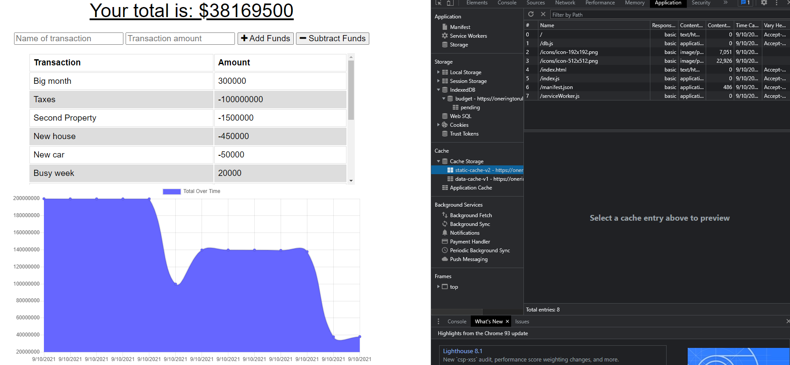

# Online-Offline-Budget-Tracker

  
#### Table of Contents
* [Project Description](#project-description)
* [Installation Instructions](#installation-instructions)
* [Usage Information](#usage-information)
* [Contributor Guidelines](#contributor-guidelines)
* [Code of Conduct](#code-of-conduct)
* [Test Instructions](#test-instructions)
* [License](#license)
* [App Link](#app-link)
* [Questions](#questions)
* [Deployment Image](#deployment-image)

## Project Description
* In this project, the user will be able to add expenses and deposits to their budget tracker with or without a connection. When entering transactions offline, they should populate the total when brought back online.

## Installation Instructions
* Express
* Mongoose
* Compression
* Morgan
* Lite-Server

## Usage Information
* You need to install the packages above to be able to run this code.

## Contributor Guidelines
* Contribution rules are under the Code of Conduct section

## Code of Conduct
* [Contributor Code of Conduct](https://www.contributor-covenant.org/version/2/0/code_of_conduct/code_of_conduct.md)

## Test Instructions
* No test required

## License
* MIT License

## App Link
* [Online/Offline Budget Tracker](https://oneringtoruleoffline.herokuapp.com/)

## Questions
* For additional help or questions about collaboration, please reach out to jpodell21@gmail.com
* Follow me on Github at 
* [JamesO1231](http://github.com/JamesO1231)

## Deployment Image

